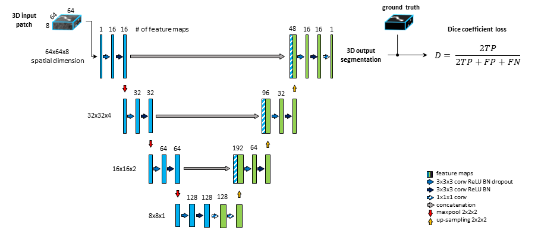
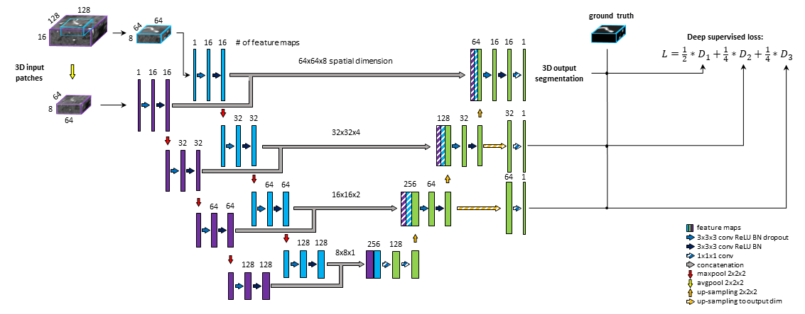

# Project documentation

This file includes full and continuously updated documentation of the full-vasculature-vessel-segmentation model.

**Goal**: Providing a fully automated vessel-segmentation framework that learns vessels of interest from data.

**Input**: 3D MRA scans  
**Output**: Binary 3D mask of vessels  
**DB**: 1kplus + Pegasus + 7UP  
**Methods**: BRAVE-NET: Unet with Context aggregation and Deep supervision  

## Database

Patients from 1kplus, Pegasus and 7UP datasets has been used.

## Methods
### Unet

The backbone of the proposed framework is realized by an adjusted U-net architecture (Ronneberger, Fischer, and Brox 2015) with 4 levels, shown on Fig. 1. We set the kernels and stride to 3x3x3 and 1 for convolutions and 2x2x2 and 2 for max-pooling. As an extension of the original U-net architecture, we add 2 consecutive fully connected layers to the last level realized by 1x1x1 convolutions.

*Fig. 1: standard U-net architecture, coined U-net, comprising of 4 levels, 2 consecutive sequences of convolution, ReLU, Batch-normalization at each level of encoding (left side) and decoding (right side) part. 2 additional fully connected layers are added to the last level realized by 1x1x1 convolutions.*

### Context information

A widely used multi-scale approach is applied (Yue et al. 2019; Kamnitsas et al. 2017; Choi et al.). The encoding part of our U-net is extended with a so-called context path. The input of this path is a larger - context - patch, extracted around the same center voxel as for the other encoding path. Inspired by Kamnitsas et al. 2017 (Kamnitsas et al. 2017), the input patch is then down-sampled by average-pooling with 2x2x2 kernels and stride of 2, i.e. to the same dimension but half-resolution compared to the other encoding path. The down-sampling allows to neglect fine details and focus on contextual information. The down-sampled input is fed into a parallel, equivalent sequence of layers. The two parallel downward paths are realized as duplicates (i.e. with no shared parameters) in order to enable distinctive feature encodings for the context and original patch. The output of the encoding paths - i.e. bottom level - are concatenated and fed through 2 fully connected layers realized by 1x1x1 convolution followed by ReLU. Finally, the residuals of each level of both encoding paths are concatenated to the input of the corresponding decoding level to facilitate the contribution of spatial and context information in the final prediction map.

### Deep supervision

Deep supervision is a method commonly used to avoid the problem of exploding or vanishing gradients in deep networks by forcing intermediate layers to produce more discriminative features. We aim to facilitate convergence of intermediate layers by direct supervision. Feature maps from intermediate decoding levels (i.e. all except bottom and final level) are first up-sampled to the output dimension and then fed into a 1x1x1 convolutional layer with sigmoid activation to produce prediction masks. From each output of the model DSC loss is computed with respect to the ground truth labeling. The loss coefficients are weighted and summed to create the training loss of the framework. We aim to reflect more emphasis on the final prediction thus assign 0.5 weight to final layer and distribute the remaining 0.5 across intermediate outputs. Our proposed model is shown on Fig.2.

*Fig. 2: U-net architecture extended with context aggregation and deep supervision, coined BRAVE-NET. Feature maps of intermediate decoding levels are up-sampled to output - spatial - dimension (striped yellow arrows) and prediction masks are produced by 1x1x1 convolution and sigmoid activation (striped blue arrows).*

## Results

Results from a 4-fold cross-validation framework are shown below. We analyzed the contribution of context-aggregation and deep supervision separately (model *Context-Unet* and *DS-Unet*) as well as together (model *BRAVE-NET*). To give a broader view on the performance of our models, we report five different metrics: Precision, Recall, DSC, 95 percentile Hausdorff Distance (95HD) and Average Hausdorff Distance (AVD). We included Precision and Recall to compare models by the quality and completeness of segmentations respectively and DSC, 95HD and AVD to assess spatial overlapping between predictions and ground truth. The evaluation metrics were calculated on whole brain segmentations (reconstructed from patch-wise predictions) to reflect the use-case, by using the open source evaluation tool from (Taha and Hanbury 2015). We report averaged values and standard deviation across test sets defined by the cross-validation framework.

A summary below shows the superiority of the proposed methods. We can see that Context-aggregation improves mainly on DSC but deep supervision can even further push our distance-based measures.

|         Model        |  DSC | AVD | 95HD | Precision | Recall |
|:--------------------:|:----:|:------:|:---------:|:-----------:|:---------:|
| Unet            | 0.928 (0.004) | 0.232 (0.041) | 33.259 (1.060) | 0.928 (0.005) | 0.929 (0.004) | 
| Context-Unet    | 0.931 (0.004) | 0.198 (0.067) | 29.279 (1.900) | 0.934 (0.006) | **0.930 (0.008)** |
| DS-Unet         | 0.927 (0.004) | 0.222 (0.033) | 33.420 (0.866) | 0.927 (0.003) | 0.929 (0.005) |  
| BRAVE-NET       | **0.931 (0.003)** | **0.165(0.013)** | **29.153 (0.988)** | **0.941 (0.005)** | 0.923 (0.004) |

## Discussion

Results clearly show that integrating context information is beneficial to make vessel segmentations more precised and accurate. Further evaluation in terms of visual assessment can be found in our publication:
<link>

